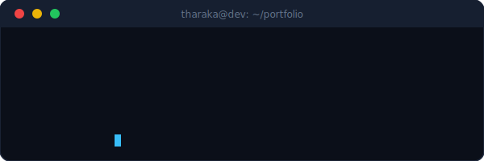
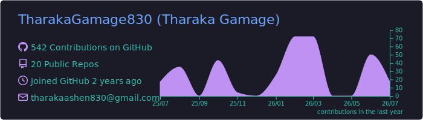
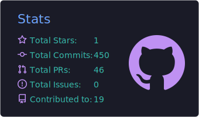
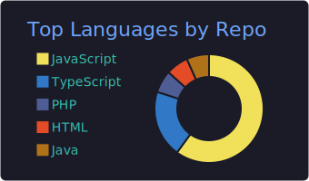
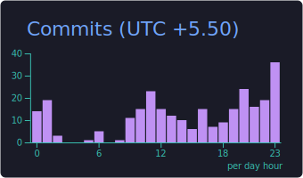
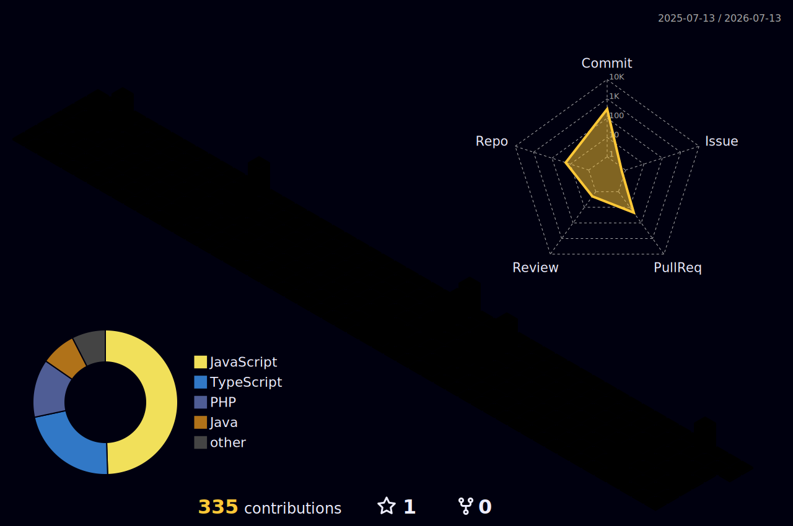
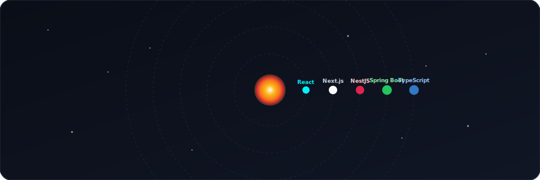

 

<table>
<tr>
<td width="30%" align="center" valign="top">

</td>
<td width="70%" align="center" valign="top">

</td>
</tr>
</table>

## About

Full-stack developer (B.Sc. Computer Science, University of Ruhuna) currently working as a **Software Engineer Intern**, shipping features on production client codebases alongside personal projects. Originally built on a Java / Spring Boot / React foundation, and over the past year expanded into the modern TypeScript ecosystem - **Next.js, NestJS, and Tailwind CSS** - to build typed, end-to-end applications across the full stack.

 

## Tech Stack

<table>
<tr>
<td valign="top" width="25%">

**Languages**
 

</td>
<td valign="top" width="25%">

**Frontend**
 

</td>
<td valign="top" width="25%">

**Backend**
 

</td>
<td valign="top" width="25%">

**Data & Tools**
 

</td>
</tr>
</table>

## 💼 Production Contributions - Software Engineer Intern

<table>
<tr><td valign="top" width="50%">

**Mahinda Panagoda Funeral Service - [Frontend](https://github.com/TharakaGamage830/Mahinda_Panagoda_Frontend) | [Backend](https://github.com/TharakaGamage830/panagoda_backend_v0.2)**
Client-facing web frontend and backend, built and maintained as part of the software engineering team.

</td>
<td valign="top" width="50%">

**[Ehelepola Walawwe](https://github.com/TharakaGamage830/ehelepola_walawwa_frontend)**
Built for a client web application.

</td></tr>
</table>

## 🏆 Major Projects

<table>
<tr>
<td valign="top" width="50%">

### 🩸 BloodConnect
Full-stack MERN platform connecting blood donors and recipients - register as a donor, request blood, manage donation events in real time.

`MongoDB` `Express` `React` `Node.js` `JWT`

[Repository →](https://github.com/TharakaGamage830/BloodConnect) · [Live Demo →](https://blood-connect-self.vercel.app/)

</td>
<td valign="top" width="50%">

### 🚗 MOSAD - Rashmi Tyre E-Business *(Contributed)*
E-business web application for Rashmi Tyre Center - stock management, ordering, and business operations.

`Java` `Spring Boot` `React` `Docker`

[Repository →](https://github.com/TharakaGamage830/MOSAD)

</td>
</tr>
</table>

## 🌐 Portfolio

**[my-portfolio](https://github.com/TharakaGamage830/my-portfolio)** - personal portfolio site.
`Next.js` `React` `Tailwind CSS`
[Live →](https://tharaka-gamage.netlify.app/)

 

## 🔨 Sample Projects

<table>
<tr>
<td valign="top" width="33%">

**⏱️ Personal Task & Time Tracker**
Task management + time tracking with a timer and analytics dashboard.

`NestJS 11` `React 19` `TypeORM` `PostgreSQL` `TypeScript`

[Repo →](https://github.com/TharakaGamage830/Personal_Task_and_Time_Tracker) · [Live →](https://task-tracker-theta-azure.vercel.app/)

</td>
<td valign="top" width="33%">

**🚌 BUS: Book-Ur-Seat**
Bus reservation and management system - real-time seat booking, full admin panel for routes/schedules.

`React` `Vite` `Node.js` `Express` `MongoDB` `JWT`

[Repo →](https://github.com/TharakaGamage830/BUS_Book-Ur-Seat)

</td>
<td valign="top" width="33%">

**📦 SalesOrderApp**
Sales order management application.

`React` `C#` `ASP.NET Core`

[Repo →](https://github.com/TharakaGamage830/SalesOrderApp)

</td>
</tr>
</table>

 

## 🎮 Projects for Language & Skill Practice

<table>
<tr>
<td valign="top" width="33%">

**🏮 Mahasona: Shadow of the Village**
Real-time social deduction game inspired by Sri Lankan folklore - 8 unique roles, live multiplayer.

`React` `TypeScript` `Tailwind` `Framer Motion` `Socket.io` `Supabase`

[Repo →](https://github.com/TharakaGamage830/Mahasona_Shadow-of-the-Village) · [Live →](https://mahasona-shadow-of-the-village.vercel.app/)

</td>
<td valign="top" width="33%">

**📊 OmniDash**
Multi-frontend admin dashboard system - admin panel, client frontend, and backend API.

`TypeScript` `JavaScript`

[Repo →](https://github.com/TharakaGamage830/OmniDash)

</td>
<td valign="top" width="33%">

**💰 ExpenseTracker**
ASP.NET Core app to record and categorize daily expenses with monthly chart reports.

`ASP.NET Core` `C#`

[Repo →](https://github.com/TharakaGamage830/ExpenseTracker)

</td>
</tr>
</table>

 

<b>🎓 University Projects (kept for history)</b>

 

- **[SafePath Observers](https://github.com/TharakaGamage830/safepath-observer)** - driving school management system. `PHP` `MySQL` `Bootstrap`
- **[WildNet](https://github.com/TharakaGamage830/WildNet)** - interactive wildlife education app. `Java` `JavaFX` `MySQL`

## GitHub Stats

*(Self-generated by a GitHub Action into this repo - no external dependency, no rate limits.)*

 

## Contribution Activity

  

## Achievements

 

  

 

